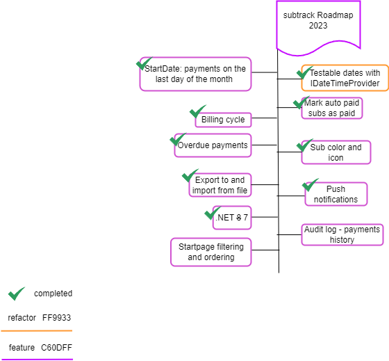

# subtrack <em>- A simplistic subscription tracker</em>

Keep track of what subscriptions you have, when they have to be paid and how much you are paying.

# Table of contents
- [Development info](#development-info)
- [MVP](#mvp)
- [Roadmap](#roadmap-2023)

# Development Info

## Running the project
The project itself currently does not require any configuration at all. On startup data is seeded to a locally stored sqlite database.

Before preceding make sure you have installed ".NET Multi-platform App UI development" in the visual studio installer

1. To begin with we only have a mobile app and we focus on making the design and functionality work for Android. You do not need an android phone to actually run the project but you do need to enable **Hyper-V** on your PC https://learn.microsoft.com/en-us/xamarin/android/get-started/installation/android-emulator/hardware-acceleration?pivots=windows. You also need to enable developer mode on your PC https://www.c-sharpcorner.com/blogs/dep0100-please-ensure-that-target-device-has-developer-mode-enabled.
2.  After enabling Hyper-V you can run the project with the **Android emulator** (built in to VS) - I am using a **Pixel 5 - API 31 (Android 12.0)** since that was default. You can add the device by opening the **Android Device Manager** inside VS

*Note that you can run the project without the android emulator as long as you won't be making any UI changes, alternatively tell someone else to verify the UI looks ok*

## Github

1. Clone the project and checkout the **dev** branch.
2. Assign yourself to an issue and create a new branch from **dev** with this format: **$"feature/{InsertTitleOfIssue}"**
3. Make some changes, commit the changes then push them to github
4. Open up a Pull request from the branch with the changes to the **dev** branch
5. Wait for other developers feedback. When the Pull request has been approved click squash merge and delete the branch afterwards

*Every feature has been labeled with "Feature" and usually contains subtasks to fulfill that specific feature. Feel free to complete multiple subtasks in one Pull request as long as you make it clear which issues the pull requests closes by writing `closes #{issueNumber}` inside the pull request description. Feel free to team up with someone and tackle an issue together, that would be a great learning experience. Some Issues might have easier to understand requirements than others, if something is unclear the best communication channel is discord.*

## Creating database migrations

After making changes to any entity you need to add a migration and update the database

1. Open up the **Package manager console** found in **View->Other Windows**
2. Change the "Default Project:" to "subtrack.DAL"
3. Enter this command in the console `add-migration {insertMigrationName} -StartupProject subtrack.DAL`
4. Make sure the generated files are as expected. If you wish to undo the migration write `remove-migration -StartupProject subtrack.DAL`
5. Enter this command in the console `update-database -StartupProject subtrack.DAL`

## Design
- This project makes use of the cyborg theme from bootswatch https://bootswatch.com/cyborg/ and bootstrap v5.3.0
- Mockups are created with drawio and any changes are saved as a png inside /docs

## MVP
#### Start page

- [x] Display total subscriptions cost per month at the top of the page
- [x] List every subscription with their name and cost 
- [x] Show how many days left each subscription is due

#### Subscriptions page

- [ ] Display every month and the total cost of subscriptions for that month
- [ ] List subscriptions under each month showing the name, cost, if it's auto paid and how many days left until it's due

#### Create page
- [ ]  Create a new subscription

#### Edit page
- [ ] Edit an existing subscription
- [ ] Delete subscription

### Details page
- [ ] Mark subscription as paid
- [ ] display all details like lastpayment

#### Start and subscriptions page
- [ ] Clicking on a subscription takes you to the edit page
- [ ] Add a + button at the bottom of the page for adding a new subscription

## WIP Roadmap 2023

